# 山火严重性分析

## 数据来源

本章讨论了卫星遥感数据在绘制野火严重程度模式以及分析其与野外-城市交界处和地形的关系中的应用。火灾严重程度是指火灾对被烧毁的生态系统的影响程度。在森林生态系统中，火灾严重程度的主要方面包括大树死亡和土壤有机质燃烧。测量火灾严重程度的一种方法是获取火灾前后的遥感图像，并评估图像中的差异，以测量火灾后植被和土壤发生了多大变化（Miller 和 Thode，2007 年）。这些数据可以与其他社会和环境数据集相结合，以研究火灾严重程度的决定因素和影响。了解这些关系对于制定管理策略以维持火灾的有益生态影响并减少对人员和财产的负面影响非常重要。

本章将应用前几章中介绍的技术来分析野火数据，并介绍一种新的统计建模技术来表征环境因素对火灾严重程度空间模式的影响。这些分析所需的大多数 R 包已在上一章中介绍过。此外，mgcv 包（Wood，2022）将用于广义加性建模，visreg 包（Breheny 和 Burchett，2020）将用于帮助可视化模型结果。

### 数据导入

首先，对文件工作路径进行切换（我这里使用的是自己的文件路径大家可自行切换）


```R
setwd("D:/desktop/gdswr_data/Chapter11")
```

导入必要的库

>这里的问题超级大每个包都没有还不能直接通过jupyter进行安装（因为真的特别慢，而且好像是卡死了）


```R
library(tidyverse)
```
```R
library(terra)
```

```R
library(ggspatial)
```


```R
library(sf)
```

```R
library(cowplot)
```


```R
library(mgcv)
```

```R
library(visreg)
```

## 1.遥感图像分析

我们将使用 Landsat 影像绘制 High Park 大火的火灾严重程度地图，该火灾于 2012 年在科罗拉多州柯林斯堡附近烧毁了 87,000 多英亩土地。
本次分析的数据来自火灾严重程度监测趋势 (MTBS) 项目 (https://www.mtbs.gov/)。
该项目使用卫星遥感技术绘制美国发生的每起重大火灾的火灾严重程度地图（Eidenshink 等人，2007 年）。
为了说明这一点，本章将从 MTBS 提供的原始卫星图像开始，并展示如何处理这些图像以制定火灾严重程度指数。
首先，导入两张 Landsat 图像。一张是在 2011 年火灾前收集的，另一张是在 2013 年火灾后收集的


```R
landsat_pre <- rast("co4058910540420120609_20110912_l5_refl.tif")
landsat_post <- rast("co4058910540420120609_20130901_l8_refl.tif")
```

生成的每个 SpatRaster 对象都是一个 30 米方形单元格的栅格，有 850 行 x 1149 列。landsat_pre 对象包含具有六个光谱波段的 Landsat 5 数据


```R
nrow(landsat_pre)

ncol(landsat_pre)

res(landsat_pre)

nlyr(landsat_pre)

ext(landsat_pre)[1:4]
```


850


1149


<ol class=list-inline><li>30</li><li>30</li></ol>


6


<dl class=dl-inline><dt>xmin</dt><dd>-801045</dd><dt>xmax</dt><dd>-766575</dd><dt>ymin</dt><dd>1985745</dd><dt>ymax</dt><dd>2011245</dd></dl>


landsat_post 对象包含具有八个光谱波段的 Landsat 8 数据。每层的前六个波段匹配，landsat_post 中的第七和第八个波段包含两个我们不会在这里使用的附加波段。这里我们查看lansat—_post数据的情况


```R
nrow(landsat_post)

ncol(landsat_post)

res(landsat_post)

nlyr(landsat_post)

ext(landsat_post)[1:4]
```


850


1149


8


<dl class=dl-inline><dt>xmin</dt><dd>-801045</dd><dt>xmax</dt><dd>-766575</dd><dt>ymin</dt><dd>1985745</dd><dt>ymax</dt><dd>2011245</dd></dl>


总体而言，R 在可视化和探索原始遥感图像方面不如专用遥感软件那么强大。但是，能够在 R 中快速查看遥感图像会很有帮助。terra 包中的 plotRGB() 函数将 Landsat 图像显示为假彩色合成图，其中短波红外波段（第 6 层）显示为红色，近红外（第 4 层）显示为绿色，绿色（第 2 层）显示为蓝色。火灾前图像以健康植被为主，它们反射近红外辐射并在假彩色图像中呈现绿色（下图）。


```R
plotRGB(landsat_pre,
        r = 6,
        g = 4,
        b = 2)
```


    
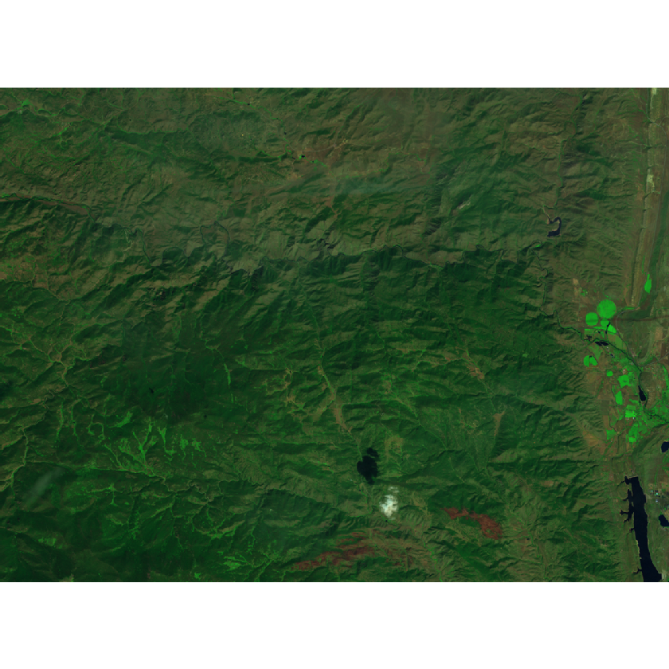
    


2012 年的大火烧毁了大片树木，烧焦区域的土壤被炭化。这些区域反射的近红外辐射较少，而短波红外辐射较多。因此，2013 年火灾过后，假彩色图像的大部分呈现红褐色（图 11.2）。


```R
plotRGB(landsat_post,
        r = 6,
        g = 4,
        b = 2)
```


    
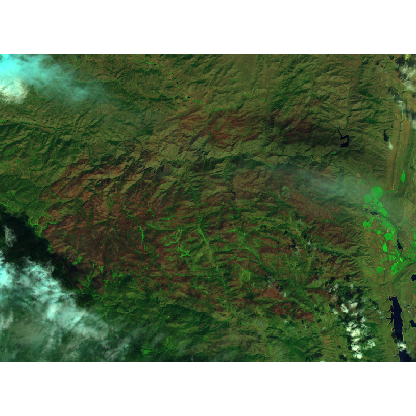
    


火灾前后的景观状况可以用归一化燃烧率 (NBR) 指数来描述。该指数测量近红外波段 (第 4 层) 与短波红外波段 (第 6 层) 之间的对比度，近红外波段在绿色植被茂盛的地区最高，而短波红外波段在土壤变黑或裸露的无植被地区最高。因此，NBR 在森林植被未受干扰的地区最高，而在火灾烧毁了大部分或所有植被并使土壤变黑的地区最低。差分归一化燃烧指数 (DNBR) 计算为火灾前后 NBR 之间的差值，可估计火灾对植被和土壤的影响。


```R
nbr_pre <- 1000 * (landsat_pre[[4]] - landsat_pre[[6]]) / (landsat_pre[[4]] + landsat_pre[[6]])
nbr_post <- 1000 * (landsat_post[[4]] - landsat_post[[6]]) / (landsat_post[[4]] + landsat_post[[6]])
dnbr <- nbr_pre - nbr_post
```

火灾前和火灾后的 NBR 栅格被组合成一个多层栅格对象并进行映射（下图）。还添加了比例尺以供参考。
由于 NBR 水平的提高通常与树木覆盖率的提高有关，因此使用了浅黄色到深绿色的色带。火灾后 NBR 较低的地区更多，但有些地方在火灾前 NBR 就已经很低了。

>这里出现了一个问题并没有找到rasterdf这个函数我研究一下如何解决

>这里找到了问题的答案，这个rasterdf函数为项目中自定义的一个函数，所以我们在他之前将该函数进行一个定义，并且可以用一个单独的R文件进行保存，在其他任一项目中我们可以通过sourse（“R文件名”）的方式进行导入。


```R
rasterdf <- function(x, aggregate = 1) {
    resampleFactor <- aggregate
    inputRaster <- x
    inCols <- ncol(inputRaster)
    inRows <- nrow(inputRaster)
    # 计算重采样栅格中的列数和行数
    resampledRaster <- rast(ncol=(inCols / resampleFactor),nrow=(inRows / resampleFactor),crs = crs(inputRaster))
    # 与原始栅格的范围匹配
    ext(resampledRaster) <- ext(inputRaster)
    # 在新栅格上重新采样数据
    y <- resample(inputRaster,resampledRaster,method='near')
    # 将单元格坐标提取到数据框中
    coords <- xyFromCell(y, seq_len(ncell(y)))
    # 提取图层名称
    dat <- stack(values(y, dataframe = TRUE))
    # 添加名称 - 数据为‘值’，不同变量为‘变量’
    # 多层栅格中的图层名称
    names(dat) <- c('value', 'variable')
    dat <- cbind(coords, dat)
    dat
}
```

自定义 rasterdf() 函数可用于将 SpatRaster 对象转换为数据框。此函数可用于任何脚本，但创建函数的代码必须始终在实际调用函数转换数据之前运行。


```R
nbr_stack <- c(nbr_pre, nbr_post)
names(nbr_stack) <- c("Pre-fire NBR", "Post-fire NBR")
nbr_stack_df <- rasterdf(nbr_stack)
ggplot(nbr_stack_df) + 
    geom_raster(aes(x = x,
                    y = y,
                    fill = value)) +
    scale_fill_gradient(name = "NBR",
                        low = "lightyellow",
                        high = "darkgreen") +
    coord_sf(expand = FALSE) + 
    annotation_scale(location = 'bl') +
    facet_wrap(facets = vars(variable),
               ncol = 1) +
    theme_void()
```

    Using plotunit = 'm'
    
    Using plotunit = 'm'
    
    


    
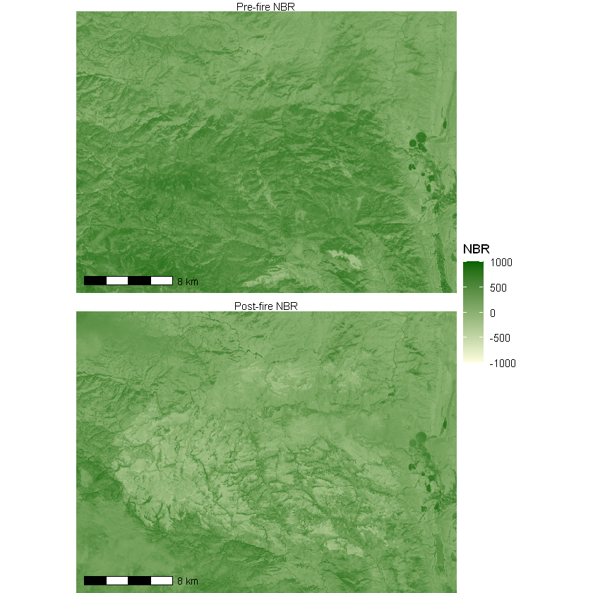
    


上图是High Park 火灾前后的 NBR 指数。

DNBR 指数突出显示了火灾后植被发生变化的位置（图 11.4）。DNBR 以零为中心，正值表示 NBR 减少，负值表示增加。因此，scale_fill_gradient2() 用于创建以零为中心的双色渐变。


```R
dnbr_df <- rasterdf(dnbr)
ggplot(dnbr_df) +
       geom_raster(aes(x = x,
                       y = y,
                       fill = value)) +
       scale_fill_gradient2(name = "DNBR",
                            low = "blue",
                            high = "red",
                            midpoint = 0) +
       coord_sf(expand = F) +
       annotation_scale(location = 'bl') +
       theme_void()
```

    Using plotunit = 'm'
    
    


    
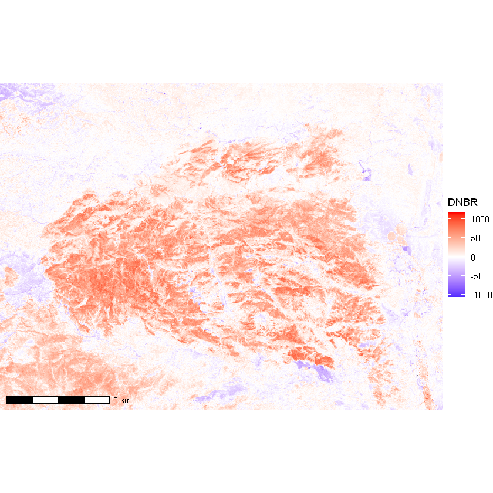
    


High Park 火灾的 DNBR 指数。

## 2. 烧伤严重程度分类

DNBR 指数将用于将图像分类为不同程度的烧伤。classify() 函数用于根据 DNBR 分配严重程度类别。以前将 classify() 与土地覆盖数据结合使用时，会使用一对一查找表将每个栅格值分配给新类别。由于 DNBR 是连续变量，因此有必要使用基于值范围的查找表

最简单的方法是创建一个有三列的矩阵：第一列包含每个范围的下限值，第二列包含每个范围的上限值，第三列包含要分配给该范围的新值。matrix() 函数采用数据向量，ncol = 3 和 byrow = TRUE 参数表示前三个值将是第一行，后三个值将是第二行，等等。然后，classify() 函数与要重新分类的栅格数据集一起使用作为第一个参数，查找表作为第二个参数。


```R
rclas <- matrix(c(-Inf, -970, NA, # Missing data
                  -970, -100, 5, # Increased greenness
                  -100, 80, 1, # Unburned
                  80, 265, 2, # Low severity
                  265, 490, 3, # Moderate severity
                  490, Inf, 4), # High severity
                ncol = 3, byrow = T)
```


```R
rclas
```


<table class="dataframe">
<caption>A matrix: 6 × 3 of type dbl</caption>
<tbody>
	<tr><td>-Inf</td><td>-970</td><td>NA</td></tr>
	<tr><td>-970</td><td>-100</td><td> 5</td></tr>
	<tr><td>-100</td><td>  80</td><td> 1</td></tr>
	<tr><td>  80</td><td> 265</td><td> 2</td></tr>
	<tr><td> 265</td><td> 490</td><td> 3</td></tr>
	<tr><td> 490</td><td> Inf</td><td> 4</td></tr>
</tbody>
</table>


```R
severity <- classify(dnbr, rclas)
```

根据植被变化推断火灾严重程度是基于这样的假设：观察到的变化是野火造成的，而不是其他土地覆盖和土地利用变化的驱动因素。因此，建议将火灾严重程度栅格屏蔽到已知的野火周长。这可以通过读取火灾边界、将其栅格化以匹配分类的火灾严重程度栅格，并屏蔽火灾周长以外的区域来实现。


```R
fire_bndy <- st_read("co4058910540420120609_20110912_20130901_bndy.shp",
                     quiet = TRUE)
bndy_rast <- rasterize(vect(fire_bndy),
                       severity,
                       field = "Event_ID")
severity <- mask(severity, bndy_rast)
```

指定了五种严重程度等级的颜色和名称向量，并与屏蔽的火灾严重程度数据集一起使用以生成地图（下图）。严重程度高表示树冠火或高强度地面火烧毁了大多数树木的区域。严重程度低表示大多数树木幸存的低强度地面火区域。严重程度混合表示树木存活率中等。在某些情况下，火灾后植被可能快速生长，火灾前植被稀疏，燃烧会引发草和其他草本植被的大量生长。


```R
SCcolors = c("darkgreen",
             "cyan3",
             "yellow",
             "red",
             "green")
SCnames = c("Unburned",
            "Low",
            "Moderate",
            "High",
            "> Green")
severity_df <- rasterdf(severity)
```


```R
unique(severity_df$value)
```


<ol class=list-inline><li>NaN</li><li>1</li><li>5</li><li>2</li><li>3</li><li>4</li></ol>


 >原文代码在这里莫名其妙报错，这里放一下源代码，后面在R-studio中尝试一下，看是否还会报错

ggplot(severity_df) +
geom_raster(aes(x = x,
y = y,
fill = as.character(value))) +
scale_fill_manual(name = "Severity Class",
values = SCcolors,
labels = SCnames,
na.translate = FALSE) +
annotation_scale(location = 'bl') +
coord_fixed(expand = F) +
theme_void()

>下面是利用kimi修改的代码，可以正确输出，但就是多了NA值的显示


```R
ggplot(severity_df) +
  geom_raster(aes(x = x, y = y, fill = as.character(value))) +
  scale_fill_manual(name = "Severity Class",
                    values = c(SCcolors,NA),  # 为NaN值指定颜色
                    labels = SCnames,
                    na.translate = FALSE) +  # 不将NA值转换为断点
  annotation_scale(location = 'bl') +
  coord_fixed(expand = FALSE) +
  theme_void()
```

    Warning message:
    "Removed 568519 rows containing missing values (`geom_raster()`)."
    Using plotunit = 'm'
    
    


    
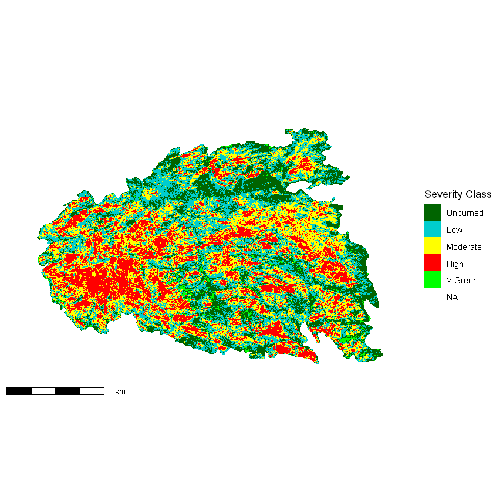
    


## 3.野外与城市的交界处

我们将通过将这些燃烧严重程度模式与其他几个地理空间数据集叠加来分析它们。野外-城市交界处 (WUI) 被定义为房屋和其他基础设施靠近野外植被的区域。“混合区”的特点是房屋和其他建筑物以低密度分散在野外，而“交界区”则是密集的城市定居点与野外植被相邻的区域 (Radeloff 等人，2005)。WUI 是火灾管理的一个重要问题，因为保护大量建筑物既困难又昂贵，尤其是当它们分散在大片混合的 WUI 区域时。因此，人们有兴趣了解像 High Park 火灾这样的大型野火在 WUI 内或附近发生的程度。

可以通过地理空间分析识别 WUI，该分析将 NLCD 的植被数据与美国人口普查的住房密度数据叠加。美国的 WUI 数据可以从 http://silvis.forest.wisc.edu/data/wui-change/ 按州下载。由于这些全州数据集规模庞大，本示例使用已裁剪到科罗拉多州部分地区的较小版本


```R
wui <- st_read("co_wui_cp12_clip.shp", quiet=TRUE)
```

WUI 数据集需要进行栅格化和裁剪，以匹配火灾严重程度数据集的几何特征。这两个数据集都采用类似的阿尔伯斯等面积坐标系，尽管椭球体的定义略有不同。


```R
writeLines(st_crs(wui)$WktPretty)
```

    PROJCS["NAD_1983_Albers",
        GEOGCS["NAD83",
            DATUM["North_American_Datum_1983",
                SPHEROID["GRS 1980",6378137,298.257222101],
                AUTHORITY["EPSG","6269"]],
            PRIMEM["Greenwich",0],
            UNIT["Degree",0.0174532925199433]],
        PROJECTION["Albers_Conic_Equal_Area"],
        PARAMETER["latitude_of_center",23],
        PARAMETER["longitude_of_center",-96],
        PARAMETER["standard_parallel_1",29.5],
        PARAMETER["standard_parallel_2",45.5],
        PARAMETER["false_easting",0],
        PARAMETER["false_northing",0],
        UNIT["metre",1,
            AUTHORITY["EPSG","9001"]],
        AXIS["Easting",EAST],
        AXIS["Northing",NORTH]]
    


```R
writeLines(st_crs(severity)$WktPretty)
```

    PROJCS["USA_Contiguous_Albers_Equal_Area_Conic_USGS_version",
        GEOGCS["NAD83",
            DATUM["North_American_Datum_1983",
                SPHEROID["GRS 1980",6378137,298.257222101004]],
            PRIMEM["Greenwich",0],
            UNIT["degree",0.0174532925199433,
                AUTHORITY["EPSG","9122"]],
            AUTHORITY["EPSG","4269"]],
        PROJECTION["Albers_Conic_Equal_Area"],
        PARAMETER["latitude_of_center",23],
        PARAMETER["longitude_of_center",-96],
        PARAMETER["standard_parallel_1",29.5],
        PARAMETER["standard_parallel_2",45.5],
        PARAMETER["false_easting",0],
        PARAMETER["false_northing",0],
        UNIT["metre",1,
            AUTHORITY["EPSG","9001"]],
        AXIS["Easting",EAST],
        AXIS["Northing",NORTH]]
    

首先重新投影 WUI 矢量数据以匹配火灾严重程度数据集的坐标系，然后裁剪到其边界。地图显示了不同 WUI 类中的 WUI 多边形，它们对应于美国人口普查区块（图 11.6）。


```R
wui_reproj <- st_transform(wui, crs(severity))
wui_crop <- st_crop(wui_reproj, severity)
ggplot(data = wui_crop) +
geom_sf(aes(fill = as.character(WUIFLAG10))) +
scale_fill_manual(name = "WUI Class",
values = c("Gray", "Orange", "Red"),
labels = c("Non-WUI", "Intermix", "Interface"),
na.translate = FALSE) +
coord_sf(expand = FALSE) +
theme_void()
```

    Warning message:
    "attribute variables are assumed to be spatially constant throughout all geometries"
    


    
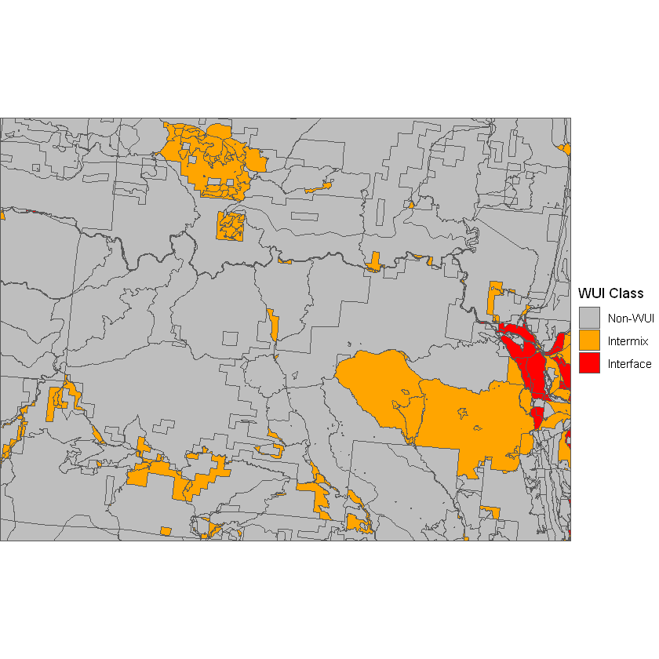
    


接下来，使用 rasterize() 函数将矢量 WUI 数据集转换为具有与火灾严重程度图层相同几何特征的栅格图层。WUIFLAG10 字段为输出栅格提供值：0 = 非 WUI、1 = 混合、2 = 界面（图 11.7）。


```R
wui_rast <- rasterize(vect(wui_crop),
severity,
field = "WUIFLAG10")
wui_rast_df <- rasterdf(wui_rast)
ggplot(wui_rast_df) +
geom_raster(aes(x = x,
                y = y,
                fill = as.character(value))) +
scale_fill_manual(name = "WUI Class",
                  values = c("Gray", "Orange", "Red"),
                  labels = c("Non-WUI", "Intermix", "Interface"),
                  na.translate = FALSE) +
coord_sf(expand = FALSE) +
theme_void()
```


    
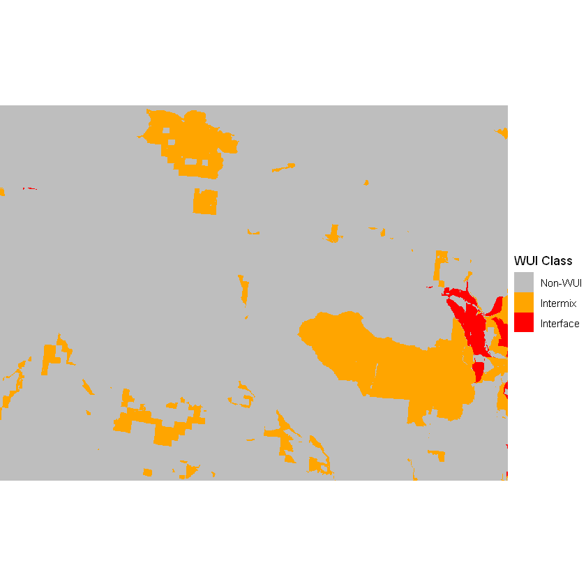
    


使用 distance() 函数计算与 WUI 的距离。计算所有具有 NA 值的单元格与没有 NA 值的最近单元格之间的距离。因此，必须首先将 WUI 栅格数据集重新分类为所有 WUI 单元格都有值且所有非 WUI 单元格为 NA 的栅格。可以使用 ifel() 函数进行这种简单的条件分配，该函数将逻辑表达式作为第一个参数，将表达式为 TRUE 时分配的值作为第二个参数，将表达式为 FALSE 时分配的值作为第三个参数。


```R
wui_na <- ifel(wui_rast == 0, NA, 1)
wui_dist <- distance(wui_na)
```

然后使用 classify() 函数将包含连续距离值的栅格重新分类为具有四个距离类别的离散栅格，方法与之前对 DNBR 所应用的方法相同。到 WUI 类别的距离显示为分类图（图 11.8）。


```R
rclas <- matrix(c(-Inf, 0, 1,
                  0, 1000, 2,
                  1000, 3000, 3,
                  3000, Inf, 4),
                ncol = 3, byrow = T)
wui_rcls <- classify(wui_dist, rcl = rclas)
wui_rcls_df <- rasterdf(wui_rcls)
ggplot(wui_rcls_df) +
geom_raster(aes(x = x,
                y = y,
                fill = as.factor(value))) +
scale_fill_manual(name = "WUI Distance",
                  values = c("Gray",
                             "Red",
                             "Orange",
                             "Yellow"),
labels = c("WUI",
           "0-1000",
           "1000-3000",
           "> 3000"),
                  na.translate = FALSE) +
coord_sf(expand = FALSE) +
theme_void()
```


    
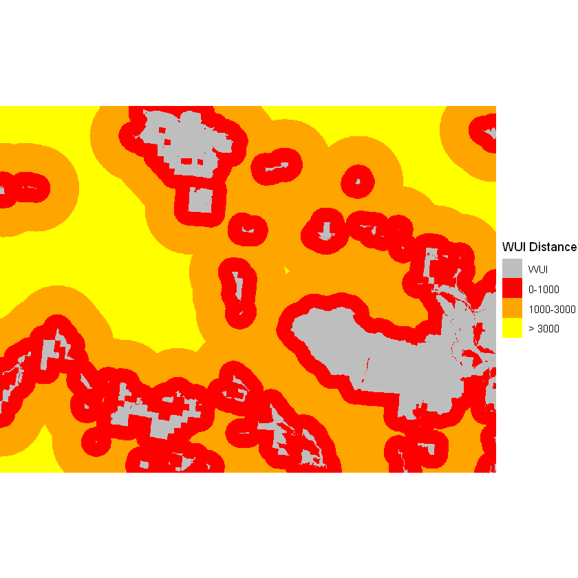
    


crosstab() 函数用于计算每个 WUI 距离类别的火灾严重程度类别分布。然后对输出进行处理，为列赋予较短的名称，将 30 米见方的单元格计数转换为公顷，并将 WUI 距离和严重程度变量转换为标记因子。


```R
wui_xtab <- crosstab(c(wui_rcls,
                       severity))
wui_df <- as_tibble(wui_xtab)

wui_df <- wui_df %>%
rename(wuidist = 1, sev = 2, ha = 3) %>%
mutate(ha = ha * 900 / 10000,
       wuidist = factor(wuidist,
                        levels = 1:4,
                        labels = c("WUI",
                                   "0-1000",
                                   "1000-3000",
                                   "> 3000")),
       sev = factor(sev,
                    levels = 1:5,
                    labels = SCnames))
```

比较这些类别的柱状图显示，距离 WUI 的距离与火灾严重程度之间存在关联（图 11.9）。在 WUI 内部和靠近 WUI 的地方，未燃烧和低严重程度是最常见的严重程度类别。但是，中等和高严重程度类别的相对数量会随着与 WUI 的距离而增加，并且在最远的距离处，高严重程度类别是最多的类别。


```R
ggplot(data = wui_df) +
geom_bar(aes(x = wuidist,
             y = ha,
             fill = sev),
         position = "dodge",
         stat = "identity") +
scale_fill_manual(name = "Severity Class",
                  values = SCcolors) +
labs(x = "WUI Distance Class",
     y = "Hectares") +
theme_bw()
```


    
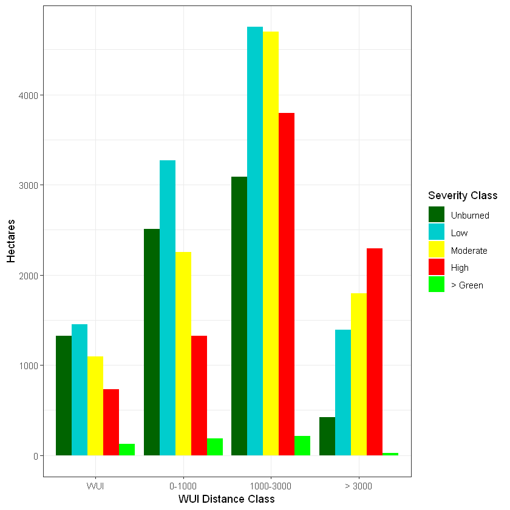
    


## 4.地形效应

下一个分析将探讨观察到的火灾严重程度模式与地形之间的关系。海拔高度通常与火灾严重程度有关，因为气候受海拔高度的强烈影响，因此不同海拔高度的森林植被类型和火灾状况也不同。
在科罗拉多前线，高海拔森林通常以北美松 (Pinus contorta) 为主，这种松树生长在密集的林分中，容易受到高强度树冠火的影响。低海拔地区则以其他树种为主，如花旗松 (Pseudotsuga menziesii) 和黄松 (Pinus ponderosa)，这些树种在一片地区被烧毁后更有可能存活下来。野火也对坡度敏感，在陡坡上蔓延得更快，在陡坡下蔓延得更慢。朝南的山坡比朝北的山坡接受更多的直接太阳辐射。由此产生的干燥条件影响植被群落并降低燃料水分，并可能导致朝南山坡的火灾严重程度更高。

### 4.1 数据处理

海拔数据是通过美国地质调查局的国家地图 (https://www. 
usgs.gov/the-national-map-data-delivery) 从国家海拔数据集 (NED) 获得的。这些数据采用地理投影，必须重新投影才能匹配火灾严重程度数据。通过将严重程度栅格作为 project() 函数的第二个参数提供，输出将投影到相同的 CRS，并与现有火灾严重程度栅格的栅格几何形状（原点、像元大小和范围）相匹配。


```R
elev <- rast("USGS_1_n41w106_20220331.tif")
writeLines(st_crs(elev)$WktPretty)
```

    GEOGCS["NAD83",
        DATUM["North_American_Datum_1983",
            SPHEROID["GRS 1980",6378137,298.257222101004]],
        PRIMEM["Greenwich",0],
        UNIT["degree",0.0174532925199433,
            AUTHORITY["EPSG","9122"]],
        AXIS["Latitude",NORTH],
        AXIS["Longitude",EAST],
        AUTHORITY["EPSG","4269"]]
    


```R
elev_crop <- project(elev,
                     severity,
                     method = "bilinear")
```

地图显示，科罗拉多前山脉的海拔总体从东向西升高，并且 High Park 火灾边界内有几条排水沟和山脊线（图 11.10）。


```R
elev_crop_df <- rasterdf(elev_crop)
ggplot(elev_crop_df) +
geom_raster(aes(x = x, y = y, fill = value)) +
scale_fill_distiller(name = "Elevation (m)",
                     palette = "Oranges") +
geom_sf(data = fire_bndy, fill = NA) +
coord_sf(expand = FALSE) +
theme_void()
```


    
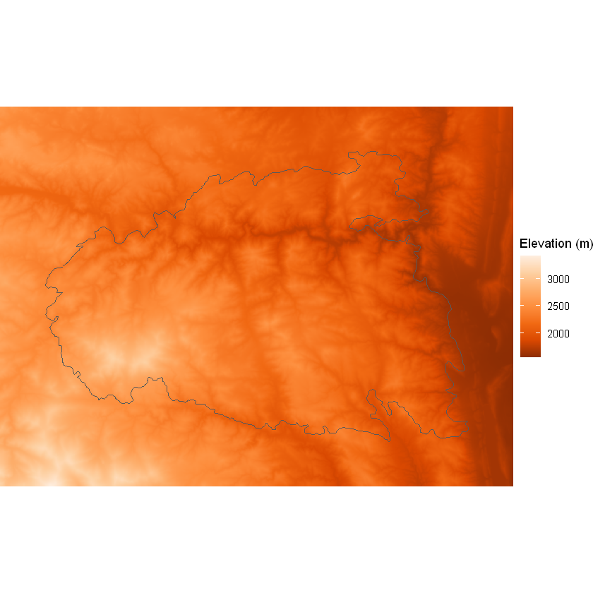
    


可以使用terrain（）函数计算坡度角，然后进行绘制


```R
slopedeg <- terrain(elev_crop,
                    v="slope",
                    unit="degrees")
slopedeg_df <- rasterdf(slopedeg)
ggplot(slopedeg_df) +
geom_raster(aes(x = x, y = y, fill = value)) +
scale_fill_distiller(name = "Slope (degrees)",
                     palette = "Oranges") +
geom_sf(data = fire_bndy, fill = NA) +
coord_sf(expand = FALSE) +
theme_void()
```


    
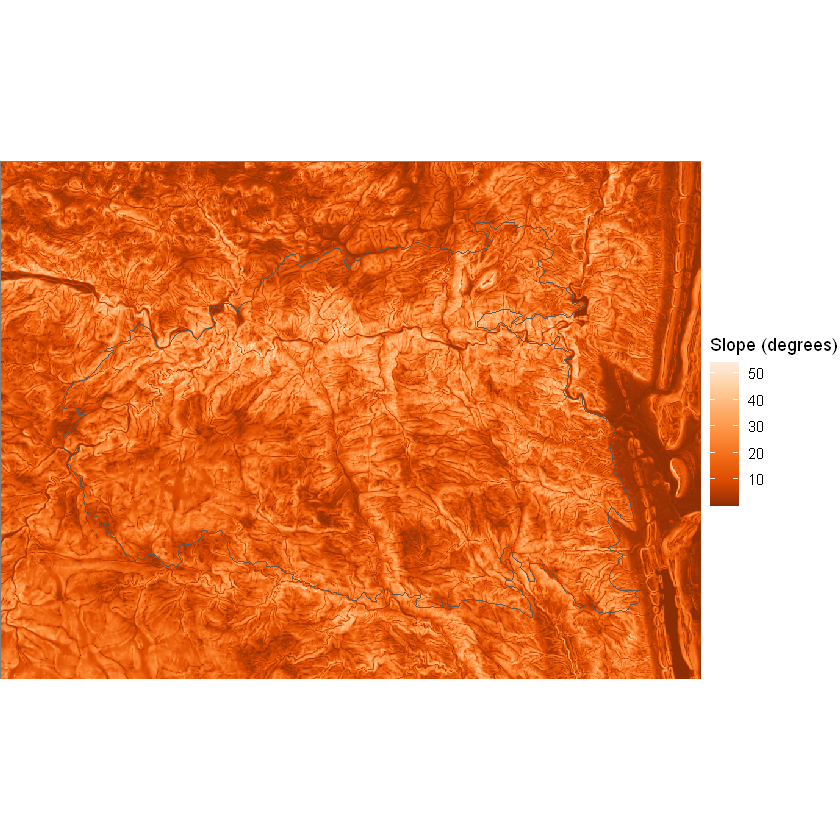
    


坡向同样使用地形（）函数计算，单位为弧度。北向的值为 0，东向的值为 0.5𝜋，南向的值为 𝜋，西向的值为 1.5𝜋。然后使用 cos() 函数将圆形坡向角转换为线性北坡指数，其中 1 表示朝北的斜坡，-1 表示朝南的斜坡（图 11.12）。


```R
aspect <- terrain(elev_crop, v="aspect", unit="radians")
nsaspect <- cos(aspect)
nsaspect_df <- rasterdf(nsaspect)
ggplot(nsaspect_df) +
geom_raster(aes(x = x, y = y, fill = value)) +
scale_fill_distiller(name = "Aspect (N-S index)",
                     palette = "Oranges") +
geom_sf(data = fire_bndy, fill = NA) +
coord_sf(expand = FALSE) +
theme_void()
```


    
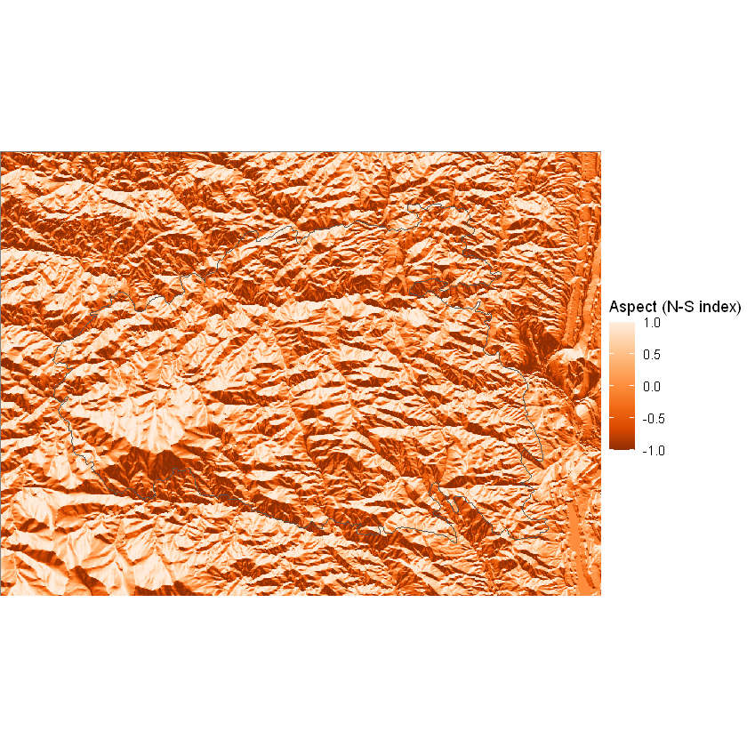
    


sin() 函数类似地用于创建东西指数，其中朝东的斜坡的值为 1，朝西的斜坡的值为 -1（图 11.13）。


```R
ewaspect <- sin(aspect)
ewaspect_df <- rasterdf(ewaspect)
ggplot(ewaspect_df) +
geom_raster(aes(x = x, y = y, fill = value)) +
scale_fill_distiller(name = "Aspect (E-W index)",
                     palette = "Oranges") +
geom_sf(data = fire_bndy, fill = NA) +
coord_sf(expand = FALSE) +
theme_void()
```


    
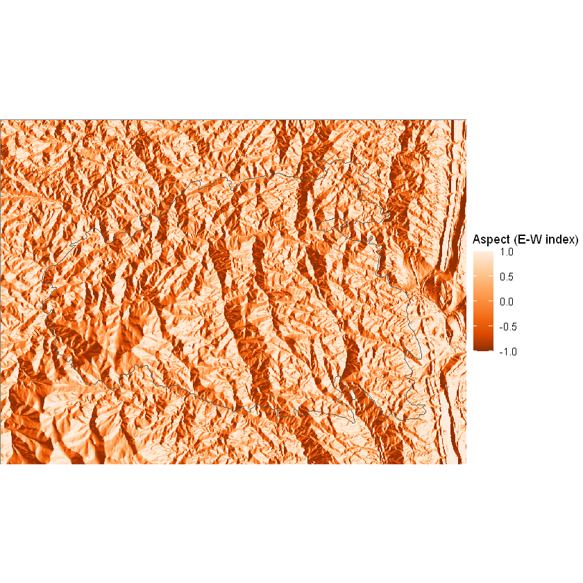
    


为了分析火灾严重程度与这些地形指数之间的关系，需要对 High Park 火灾边界内的点进行采样。
第一步是将 DNBR 与地形指数组合成一个多层栅格对象。


```R
fire_stack <- c(dnbr,
                elev_crop,
                slopedeg,
                nsaspect,
                ewaspect)
```

st_sample() 函数用于生成一组随机点，就像第 10 章中所做的那样。在这种情况下，提供了几个附加参数。这些点被限制在 fire_bndy 多边形数据集内。type = SSI 参数表示将使用简单的顺序抑制过程来生成点。生成第一个随机点后，只有当后续点与最近点的距离超过阈值距离时，才会接受它们。r 参数表示点之间的最小距离，n 表示要采样的点数。生成的 sample_pts 数据集与 fire_bndy 位于相同的坐标参考系中，但坐标参考系不会自动定义，必须手动指定。


```R
set.seed(23456)
sample_pts <- st_sample(
    fire_bndy,
    type = "SSI",
    r = 500,
    n = 300
)
st_crs(sample_pts)
```


    Coordinate Reference System: NA


```R
st_crs(sample_pts) <- st_crs(fire_bndy)
```

### 4.2 广义加性建模

在这种情况下，设置最小距离是可取的，因为附近栅格单元的值往往彼此高度相关，而使用间距较大的点有助于确保广泛覆盖并最大限度地提高每个样本的独立性（图 11.14）。如第 10 章所述，设置随机数种子可确保多次运行代码将生成相同的随机数序列。


```R
ggplot(dnbr_df) +
geom_raster(aes(x = x,
                y = y,
                fill = value)) +
scale_fill_gradient2(name = "DNBR",
                     low = "blue",
                     high = "red",
midpoint = 0) +
geom_sf(data = fire_bndy, fill = NA) +
geom_sf(data = sample_pts) +
coord_sf(expand = F) +
theme_void()
```


    
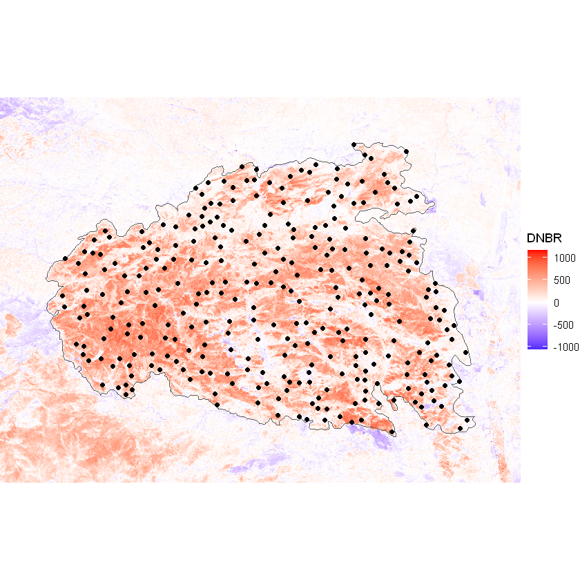
    


上图，采样点和火灾边界叠加在 High Park 火灾的 DNBR 指数上。

然后使用 extract() 函数提取这些点位置处的栅格数据，并重命名结果数据框的列。


```R
fire_pts <- extract(fire_stack, vect(sample_pts))
fire_pts <- rename(fire_pts,
                   dnbr = 2,
                   elevation = 3,
                   slope = 4,
                   nsaspect = 5,
                   ewaspect = 6
                  )
```

为了探索火灾严重程度与地形之间的关系，使用 mgcv 库中的 gam() 函数应用广义加性模型 (GAM)。该模型的规范类似于之前使用 lm() 函数运行的线性模型。模型公式指定为波浪号 (~) 左侧的因变量和右侧由加号 (+) 分隔的自变量。此外，每个自变量都包含在 s() 函数中，该函数默认将因变量建模为平滑薄板样条函数。当底层关系不被认为是线性时，这种方法是合理的。


```R
fire_gam <- gam(dnbr ~
                s(elevation) +
                s(slope) +
                s(nsaspect) +
                s(ewaspect),
                data = fire_pts)
```

gam 对象的摘要方法与 lm() 对象的摘要方法大体相似，但仔细观察就会发现它们之间存在一些重要差异。例如，每个独立变量都有一个检验统计量表和 p 值，但没有线性模型那样的系数值。
估计自由度 (edf) 提供有关关系非线性程度的信息，值越高表示非线性关系越复杂。


```R
class(fire_gam)
```


<ol class=list-inline><li>'gam'</li><li>'glm'</li><li>'lm'</li></ol>


```R
summary(fire_gam)
```


    
    Family: gaussian 
    Link function: identity 
    
    Formula:
    dnbr ~ s(elevation) + s(slope) + s(nsaspect) + s(ewaspect)
    
    Parametric coefficients:
                Estimate Std. Error t value Pr(>|t|)    
    (Intercept)   272.54      10.23   26.63   <2e-16 ***
    ---
    Signif. codes:  0 '***' 0.001 '**' 0.01 '*' 0.05 '.' 0.1 ' ' 1
    
    Approximate significance of smooth terms:
                   edf Ref.df      F  p-value    
    s(elevation) 5.489  6.656 17.609  < 2e-16 ***
    s(slope)     2.708  3.418  9.257 4.21e-06 ***
    s(nsaspect)  1.000  1.000 53.578  < 2e-16 ***
    s(ewaspect)  4.351  5.323  1.547    0.167    
    ---
    Signif. codes:  0 '***' 0.001 '**' 0.01 '*' 0.05 '.' 0.1 ' ' 1
    
    R-sq.(adj) =  0.411   Deviance explained = 43.8%
    GCV =  33017  Scale est. = 31416     n = 300


要理解 GAM 建模的平滑关系，需要绘制它们。gam 对象具有 plot() 方法，该方法使用基本 R 图形绘制部分残差作为每个独立变量的函数。
这些部分残差表示在去除所有其他地形指数的建模效果后，DNBR 与每个地形指数之间的关系（图 11.15）。输出显示，DNBR 与海拔呈单峰关系，峰值约为 2700 米。与坡度的关系也是单峰的，峰值约为 22 度。与南北指数的关系是线性的，朝南的方面火灾严重程度最高。与东西方面的​​关系相对较弱，没有显示出明显的模式。


```R
plot(fire_gam, pages = 1)
```


    
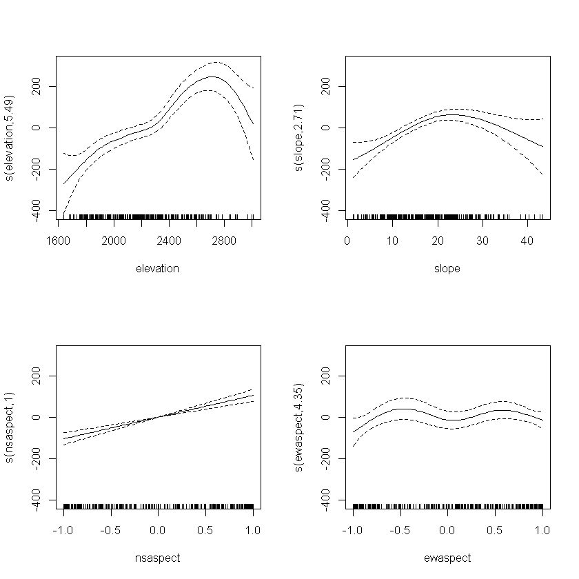
    


还可以使用 visreg 包中的 visreg() 函数生成偏回归图。通过指定 gg = TRUE 参数，可以使用 ggplot() 生成图，并且可以指定其他 ggplot 函数来修改其外观。在这里，会为每个独立变量生成一个偏回归图并将其保存到 ggplot 对象中。


```R
elev_gg <- visreg(fire_gam,
                  "elevation",
                  gg = TRUE) +
theme_bw()
slope_gg <- visreg(fire_gam,
                   "slope",
                   gg = TRUE) +
theme_bw()
nsasp_gg <- visreg(fire_gam,
                   "nsaspect",
                   gg = TRUE) +
theme_bw()
ewasp_gg <- visreg(fire_gam,
                   "ewaspect",
                   gg = TRUE) +
theme_bw()
```

然后，如第 5 章所示，可以使用 cowplot 包中的 plot_grid() 函数将这些多个图排列成一个更大的多面板图形（图 11.16）。


```R
plot_grid(elev_gg, slope_gg, nsasp_gg, ewasp_gg,
          labels = c("A)", "B)", "C)", "D)",
                     label_size = 12),
          ncol = 2,
          hjust = 0,
          label_x = 0,
          align = "hv")
```


    
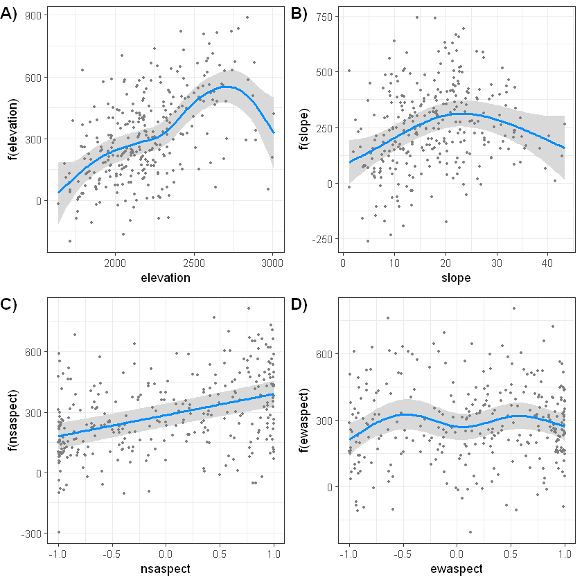
    


上图为：使用 virdis 包生成的地形指数和火灾严重程度之间关系的偏回归图。
